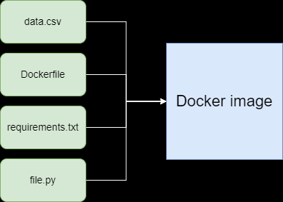

# task 9
## Архитектура приложения:

## Установка:
1. Установить docker desktop, python, удобную IDE.
2. Создать папку, в которую добавить файлы Dockerfile, task9.py, requirements.txt, data.csv.
3. В терминале написать следующую команду: `docker build -t task9 .` (Где task9 - название изображения в докере, оно может быть любым)
4. После выполнения предыдущей команды, в терминале написать следующее: `docker run task9`.
### Вуаля, приложение работает!
## Дополнительная информация:
Чтобы добавить еще инструкции, необходимо прописывать их в файле task9.py. Это производится с использованием библиотеки pandas. 
Python и Pandas - это одно из оптимальных решений данного проекта. Оно легко в использовании и настройке. Более того, разработчик может полностью контролировать работу проекта. Оповещения записываются в txt файлы. Если вы решили добавить новые инструкции, то нужно повторить пункты 3, 4 из установки.

